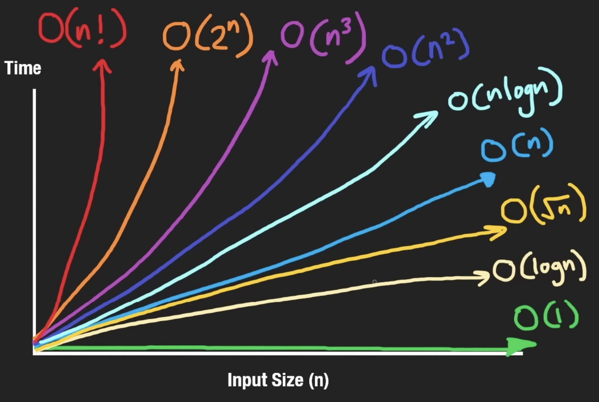

# Big-O Cheat Sheets
## Code from Neetcode's _Big-O Notation for Coding Interviews_
Link: https://neetcode.io/courses/lessons/big-o-notation

Run the bash script using ``bash run_all.sh`` to run all python scripts.

